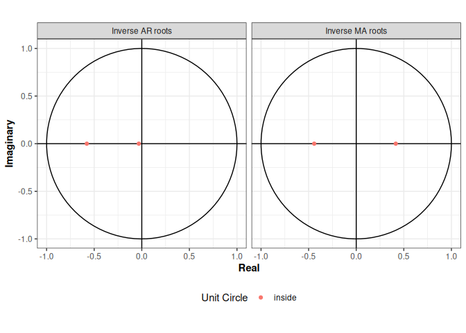
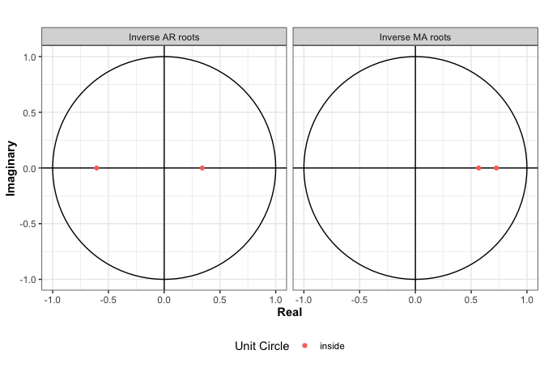

<!-- README.md is generated from README.Rmd. Please edit that file -->

# arima2

<!-- badges: start -->

[](https://github.com/jeswheel/arima2/actions/workflows/R-CMD-check.yaml)
<!-- badges: end -->

The goal of `arima2` is to provide a set of tools to aid in the analysis
of time series data in `R`. One such function is `arima2::arima`, which
provides an interface to estimating Auto Regressive Integrated Moving
Average (ARIMA) models using a random-restart algorithm. This function
improves on the functionality of the `stats::arima` method, as it has
the potential to increase the likelihood of the final output model. By
design, the function cannot result in models with lower likelihoods than
that of the `stats::arima` function. The potential for increased model
likelihoods is obtained at the cost of computational efficiency. The
function is approximately $n$ times slower than the `stats::arima`
function, where $n$ is the number of random restarts. The benefit of
trying multiple restarts becomes smaller as the number of available
observations increases. Because the estimation of ARIMA models takes
only a fraction of a second on relatively small data sets (less than a
thousand observations), we are of the opinion that potential to increase
model likelihoods is well worth this computational cost. The `arima`
function implementation relies heavily on the source code of the
`stats::arima` function.

## Installation

``` r
# Install from CRAN
install.packages("arima2")
```

You can install the development version of `arima2` from
[GitHub](https://github.com/) with:

``` r
# install.packages("devtools")
devtools::install_github("jeswheel/arima2")
```

## Example

This is a basic example which shows you how to solve a common problem:

``` r
library(arima2)
#> 
#> Attaching package: 'arima2'
#> The following object is masked from 'package:stats':
#> 
#>     arima

set.seed(83131)  

# Get model coefficients from ARMA(2, 2)
coefs <- sample_ARMA_coef(order = c(2, 2))

# Get model intercept 
intercept <- rnorm(1, sd = 50)

# Generate data from ARMA model 
x <- intercept + arima.sim(
  n = 100, 
  model = list(ar = coefs[grepl("^ar[[:digit:]]+", names(coefs))], 
               ma = coefs[grepl("^ma[[:digit:]]+", names(coefs))])
)

# Fit ARMA model using arima2 and stats::arima 
arma2 <- arima(x, order = c(2, 0, 2), max_iters = 20)
arma <- stats::arima(x, order = c(2, 0, 2))
```

In the example above, the resulting log-likelihood of the `stats::arima`
function is -142.24, and the log-likelihood of the `arima` function is
-139.91. For this particular model and dataset, the random restart
algorithm implemented in `arima2` improved the model likelihood by 2.33
log-likelihood units.

Our package creates a new `S3` object that we call `Arima2`, which
extends the `Arima` class of the `stats` package. Once the model has
been fit, our package includes some features that help diagnose the
fitted model using this new child class. For example, `ARMApolyroots`
function will return the AR or MA polynomial roots of the fitted model:

``` r
ARMApolyroots(arma2, type = 'AR')
#> [1]  -4.464118+0i -15.209006+0i
ARMApolyroots(arma2, type = 'MA')
#> [1] -0.9870024+0.665084i -0.9870024-0.665084i
```

We have also implemented a `plot.Arima2` function that uses the
`ggplot2` package so that we can visualize a fitted model. To compare
the roots of the model fit using multiple restarts to the model fit
using `stats::arima`, I will modify the class of the `arma` object so
that it can easily be plotted.

``` r
class(arma) <- c("Arima2", class(arma))

plot(arma)
```



``` r
plot(arma2)
```



Finally, if a user would like help in determining an appropriate number
of coefficients, we provide the `aicTable` function. The package also
includes an `aicTable` function, which prints the AIC values for all
ARMA$(p, d, q)$, with $p \leq P$, $q \leq Q$, and $d = D$:

``` r
set.seed(443252)
tab_results <- aicTable(x, P = 4, Q = 4, D = 0) 

tab_results |> knitr::kable()
```

|     |      MA0 |      MA1 |      MA2 |      MA3 |      MA4 |
|:----|---------:|---------:|---------:|---------:|---------:|
| AR0 | 368.7800 | 302.8397 | 290.2196 | 290.1671 | 291.4220 |
| AR1 | 319.4248 | 295.5320 | 289.8299 | 291.6313 | 292.9708 |
| AR2 | 303.4653 | 295.7739 | 291.8176 | 291.5108 | 294.0785 |
| AR3 | 296.6288 | 296.2828 | 292.9434 | 292.9987 | 293.5101 |
| AR4 | 295.1954 | 297.1895 | 294.9198 | 294.3391 | 294.9258 |

``` r

P <- which(tab_results == min(tab_results), arr.ind = TRUE)[1] - 1
Q <- which(tab_results == min(tab_results), arr.ind = TRUE)[2] - 1

print(paste0("p = ", P, "; q = ", Q))
#> [1] "p = 1; q = 2"
```

For more details about this package, please see our arXiv paper:
[arXiv:2310.01198](https://doi.org/10.48550/arXiv.2310.01198)
