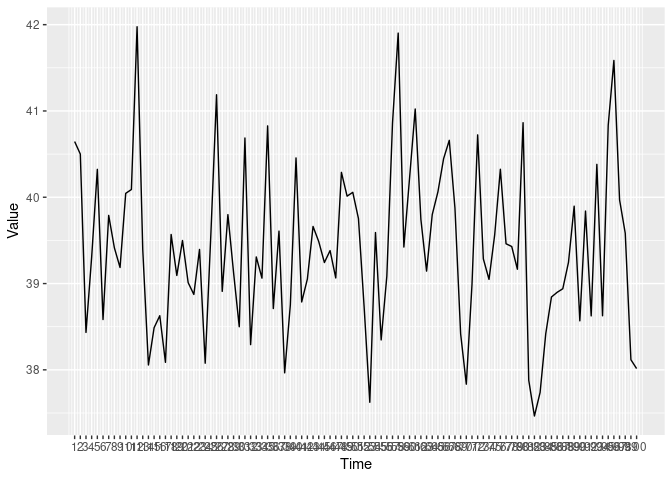

<!-- README.md is generated from README.Rmd. Please edit that file -->

# arima2

<!-- badges: start -->
<!-- badges: end -->

The goal of `arima2` is to provide a set of tools to aid in the analysis
of time series data in `R`. One such function is `arima2::arima`, which
provides an interface to estimating Auto Regressive Integrated Moving
Average (ARIMA) models using a random-restart algorithm. This function
improves on the functionality of the `stats::arima` method, as it has
the potential to increase the likelihood of the final output model. By
design, the function cannot result in models with lower likelihoods than
that of the `stats::arima` function. The potential for increased model
likelihoods is obtained at the cost of computational efficiency. The
function is order $O(n)$ times slower than the `stats::arima` function,
where $n$ is the number of random restarts. Because the estimation of
ARIMA models takes only a fraction of a second, we are of the opinion
that potential to increase model likelihoods is well worth this
computational cost. The `arima` function is implemented by modifying the
source code of the `stats::arima` function.

## Installation

You can install the development version of arima2 from
[GitHub](https://github.com/) with:

``` r
# install.packages("devtools")
devtools::install_github("jeswheel/arima2")
```

## Example

This is a basic example which shows you how to solve a common problem:

``` r
library(arima2)
#> 
#> Attaching package: 'arima2'
#> The following object is masked from 'package:stats':
#> 
#>     arima

set.seed(41319)  

# Get model coefficients from ARMA(2, 2)
coefs <- sample_ARMA_coef(order = c(2, 2))

# Get model intercept 
intercept <- rnorm(1, sd = 50)

# Generate data from ARMA model 
x <- intercept + arima.sim(
  n = 100, 
  model = list(ar = coefs[grepl("^ar[[:digit:]]+", names(coefs))], 
               ma = coefs[grepl("^ma[[:digit:]]+", names(coefs))])
)

# Fit ARMA model using arima2 and stats::arima 
arma2 <- arima(x, order = c(2, 0, 2), max_iters = 20)
arma <- stats::arima(x, order = c(2, 0, 2))
```

In the example above, the resulting log-likelihood of the `stats::arima`
function is -134.89, and the log-likelihood of the `arima` function is
-130.91. For this particular model and dataset, the random restart
algorithm implemented in `arima2` improved the model likelihood by 3.97
log-likelihood units.

Our package creates a new `S3` object that we call `Arima2`, which
extends the `Arima` class of the `stats` package. Once the model has
been fit, our package includes some features that help diagnose the
fitted model using this new child class. For example, `ARMApolyroots`
function will return the AR or MA polynomial roots of the fitted model:

``` r
ARMApolyroots(arma2, type = 'AR')
#> [1] 0.689026+0.7411728i 0.689026-0.7411728i
ARMApolyroots(arma2, type = 'MA')
#> [1] 0.6506962+0.7593438i 0.6506962-0.7593438i
```

We have also implemented a `plot.Arima2` function that uses the
`ggplot2` package so that we can visualize a fitted model.

One can visualize the roots of the fitted model, by specifying the
argument `roots = TRUE`:

``` r
plot(arma2, roots = TRUE)
#> Registered S3 method overwritten by 'quantmod':
#>   method            from
#>   as.zoo.data.frame zoo
#> Registered S3 method overwritten by 'forecast':
#>   method        from  
#>   summary.Arima arima2
```



Finally, if a user would like help in determining an appropriate number
of coefficients, we provide the `aicTable` function.
